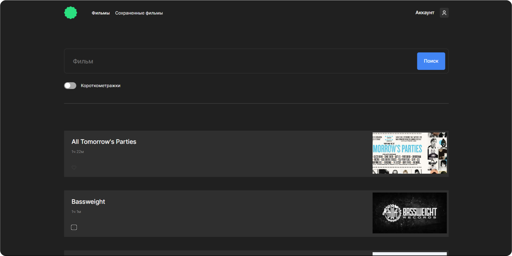
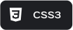
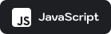
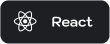
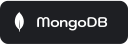
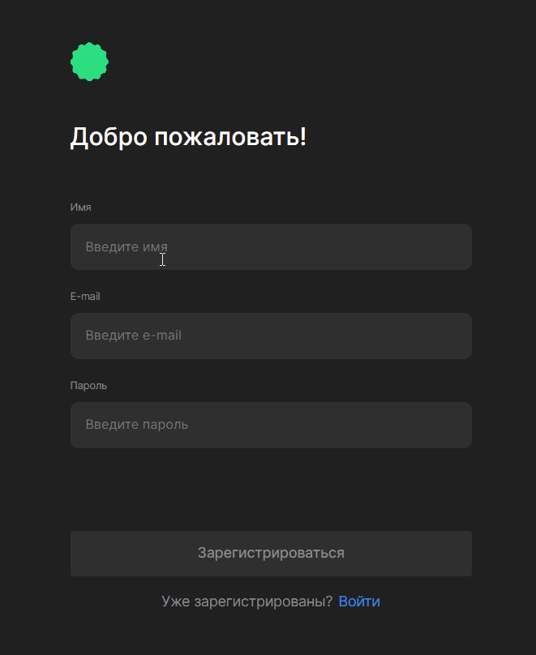
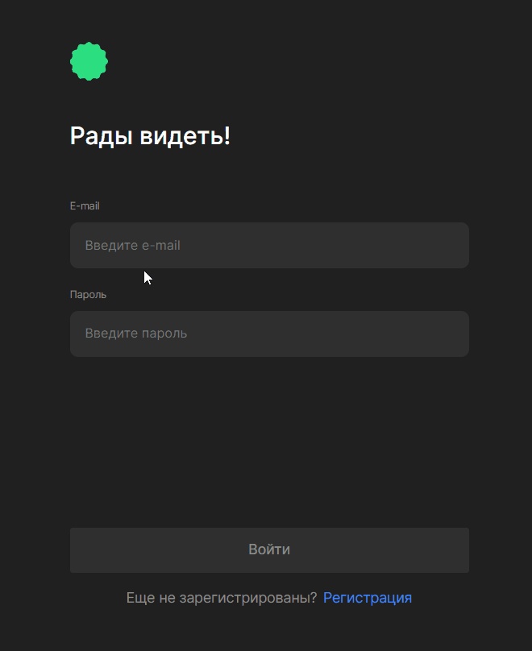
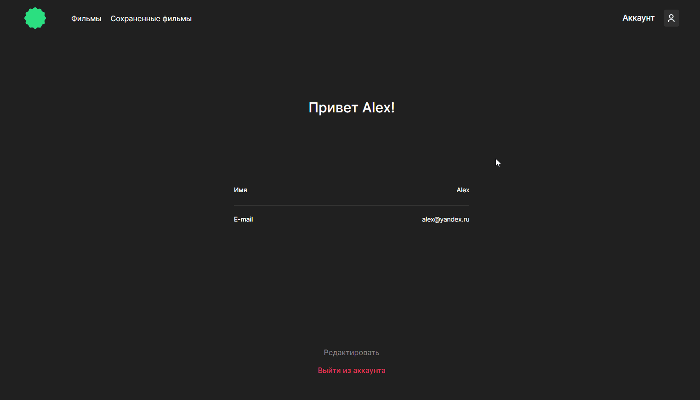
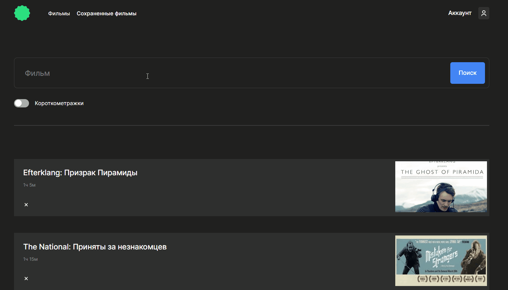
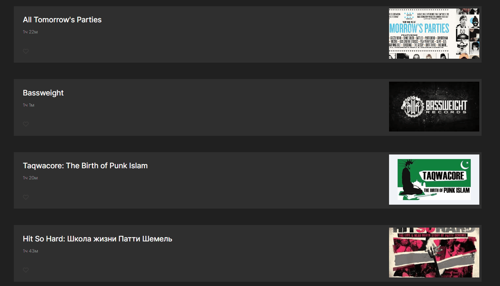

<a id="readme-top"></a>


<details>
<summary>Содержание</summary>
  <ol>
    <li>
      <a href="#о-проекте">О проекте</a>
      <ul>
        <li><a href="#стек-технологий">Стек техологий</a></li>
        <li><a href="#функциональность">Функциональность</a></li>
        <li><a href="#сайт">Сайт</a></li>
      </ul>
    </li>
    <li>
      <a href="#инструкция-по-развертыванию">Инструкция по развертыванию</a>
      <ul>
        <li><a href="#системные-требования">Системные требования</a></li>
        <li><a href="#установка">Установка</a></li>
      </ul>
    </li>
    <li><a href="#автор">Автор</a></li>
  </ol>
</details>

## О проекте

Сервис по поиску и сохранинию понравившихся фильмов

> Проект был реализован в рамках продолжения изучения и закрепления материала теxнологий React и Express. В процессе разработки изучил фильтрацию данных на стороне клиента

### Стек технологий

[Nginx]: ./images/icons/icons/nginx.svg
[Nginx-url]: https://nginx.org/

<p align='center'> 
<a href='https://html.com/html5/'></a>
<a href='https://www.w3.org/Style/CSS/'></a>
<a href='https://www.javascript.com/'></a>
<a href='https://reactjs.org/'></a>
<a href='https://nodejs.org/en'></a>
<a href='https://expressjs.com'></a>
<a href='https://www.mongodb.com/'></a>
<a href='https://nginx.org/'></a>
</p>

<p align="right"><a href="#readme-top"></a></p>

### Функциональность

- Адаптивная верстка сайта для устройств, с разрешением экрана от 320px (максимальная ширина контента 880px);
- Регистрация и авторизация пользователя,
- Аторизация пользователя по JWT,
- Поиск фильмов по открытому API Beat Film
- В проекте реализованы возможности:

  - Регистрация и авторизация;

  <p align='center'>
  
  
  </p>

  - Редактирование профиля;

    

  - Поиск фильмов и фильтрация по длительности;

    

  - Поиск фильмов в избранном;

    

  - Добавление и удаление фильмов в избранное;

    

<p align="right"><a href="#readme-top"></a></p>

### Сайт

<p align="center"><a href="https://zhdko.movies.nomoredomains.rocks/"></a></p>

## Инструкция по развертыванию

### Системные требования

| software |          version |
| -------- | ---------------: |
| node     |           19.0.0 |
| npm      |            9.3.1 |
| mongod   |           4.4.20 |
| git      | 2.37.3.windows.1 |

<details>
<summary>Front-end</summary>

| packet           | version |
| ---------------- | ------: |
| react, react-dom |  18.2.0 |
| react-router-dom |  6.11.2 |

</details>
<details>
<summary>Back-end</summary>

| packet                    | version |
| ------------------------- | ------: |
| bcryptjs                  |   2.4.3 |
| celebrate                 |  15.0.1 |
| cookie-parser             |   1.4.6 |
| cors                      |   2.8.5 |
| eslint                    |  8.41.0 |
| eslint-config-airbnb-base |  15.0.0 |
| eslint-plugin-import      |  2.27.5 |
| express                   |  4.18.2 |
| express-winston           |   4.2.0 |
| express-rate-limit        |   6.7.0 |
| helmet                    |   7.0.0 |
| jsonwebtoken              |   9.0.0 |
| mongoose                  |   7.2.1 |
| rate-limit                |   0.1.1 |
| nodemon                   |  2.0.22 |
| validator                 |  13.9.0 |
| winston                   |   3.9.0 |
| dotenv                    |  16.0.3 |

</details>
<p align="right"><a href="#readme-top"></a></p>

### Установка

1. Установить необходимые программы:

   - GIT ( [Инструкция](https://git-scm.com/book/en/v2/Getting-Started-Installing-Git) )
   - MongoDB ( [Инструкция](https://mongodb.prakticum-team.ru/docs/manual/tutorial/install-mongodb-on-windows/#install-mdb-edition) )
   - NodeJS и npm ( [Инструкция](https://docs.npmjs.com/downloading-and-installing-node-js-and-npm) )</br>

2. Клонировать репозиторий и установить зависимости:

   - Через терминал перейти в репозиторий, в который планируете склонировать проект и ввести команду:

     ```bash
     git clone https://github.com/Zhdko/movies-explorer-full.git
     ```

   - Перейти в репозиторий проекта:

     ```bash
     cd movies-explorer-full
     ```

   - Установить зависимости клиентской части:

     ```bash
     cd frontend
     npm install
     ```

   - Установить зависимости серверно части:

     ```bash
     cd backend
     npm install
     ```

3. Настройка конфигурационного файла

   > После настройки и получения URL-адреса MongoDB (по умолчанию: `mongodb://localhost:27017`)<br> скопируйте URL в файл `config.js`

- Перейти в файл `/backend/utils/config.js`
- Ввести свой путь к базе данных вместо `'mongodb://127.0.0.1:27017/mesto'`

```javascript
const MONGO_DB = NODE_ENV === 'production' ? DB : 'mongodb://127.0.0.1:27017/movieExplorer';
```

4. Запустить MongoDB в терминале

```bash
  mongod
```

5. Запустить сервер из деректории `/react-mesto-api-full-gha/backend`

```bash
  npm start
```

6. Запустите реакт приложение из деректории `/react-mesto-api-full-gha/backend`

```bash
  npm run start
```

[](https://git.io/typing-svg)

<p align="right"><a href="#readme-top"></a></p>

## <a id='автор' href='https://github.com/Zhdko'></a>

<div align='right'>
  <a href='https://github.com/Zhdko'></a>
  <a href='https://www.linkedin.com/in/zhdko/'></a>
</div>
